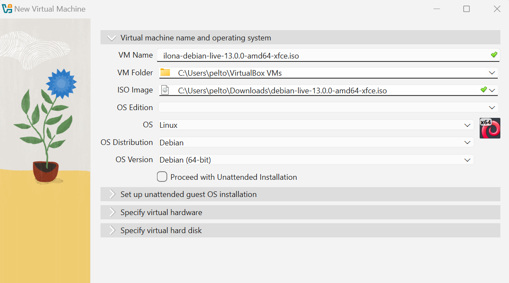
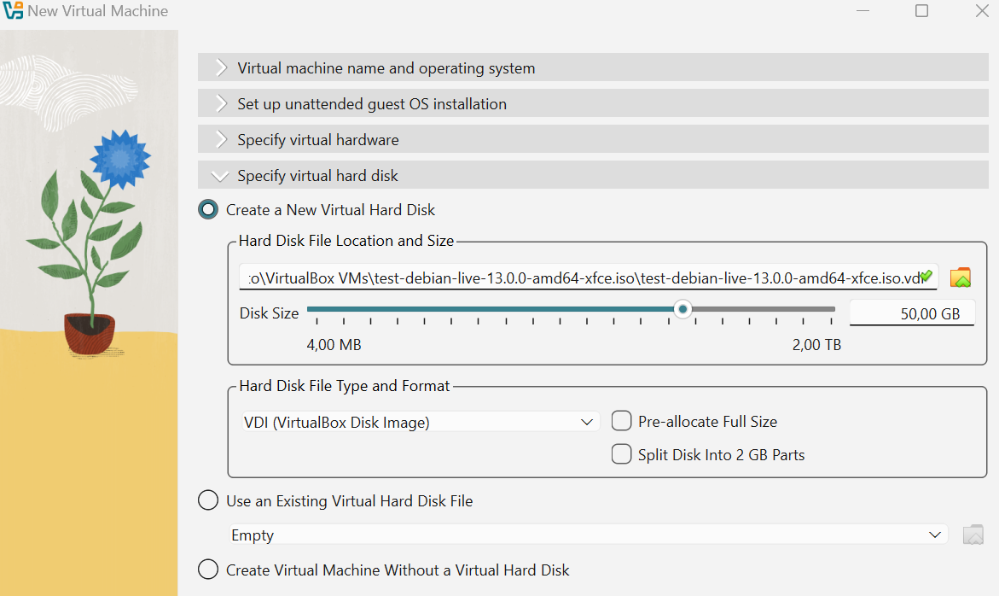
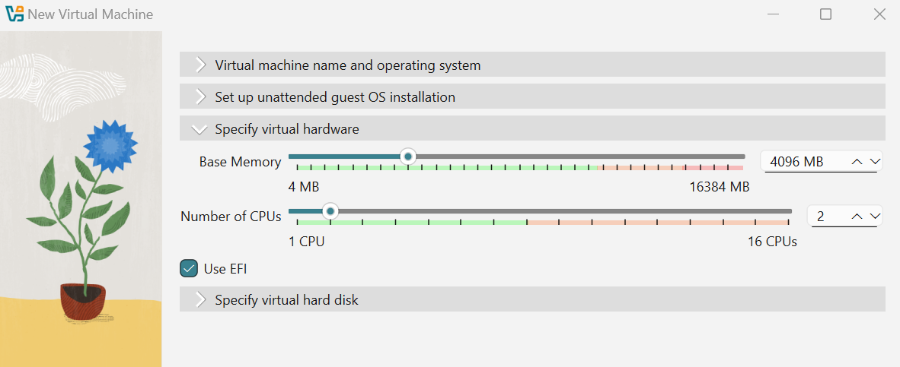
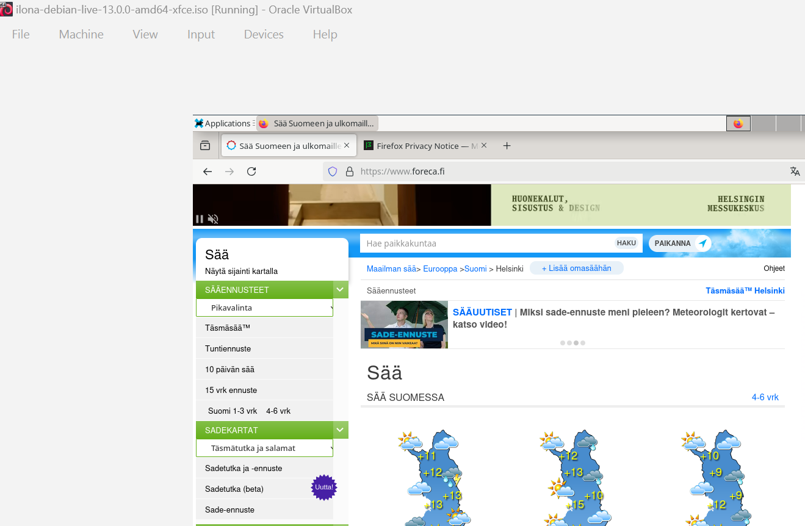
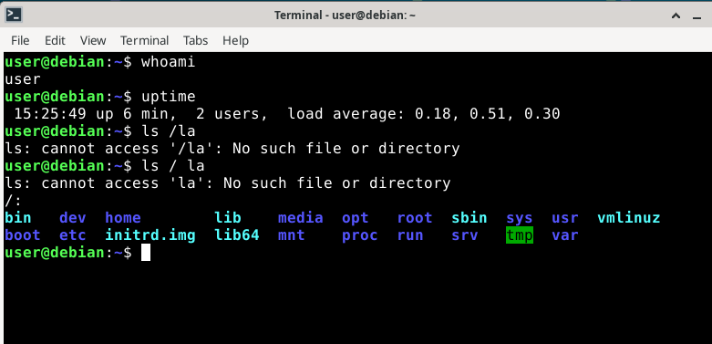
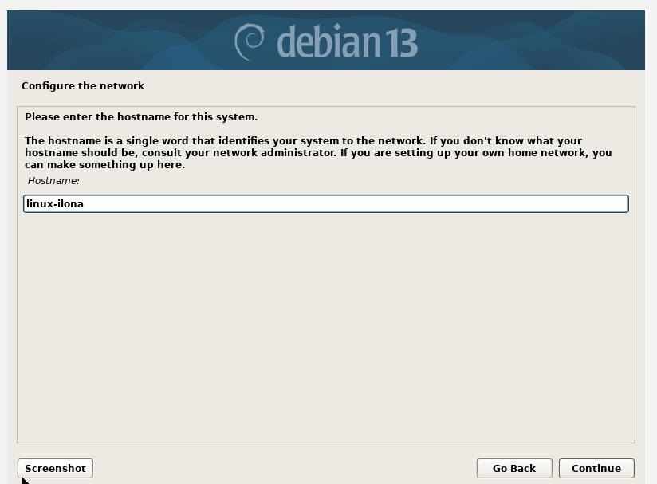
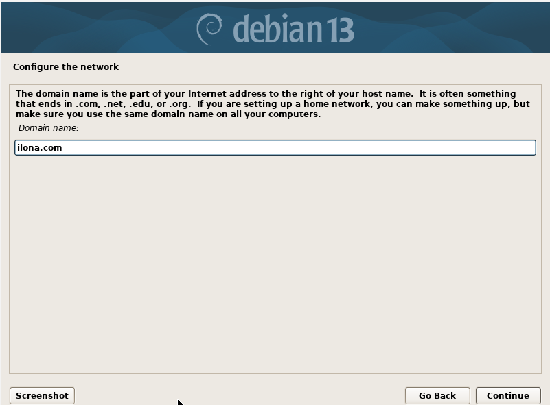

# h1 Oma Linux

RAPORTIN KIRJOITTAMINEN 
- Toistettavuus: Raportissa tulee olla kaikki kohdat sekä ympäristö kuvattuna niin, että joku muu voisi saada saman tuloksen kaikkine vaiheineen
- Täsmällisyys: Raportoi komennot/klikkaukset sekä kellonajat. Jos jokin ei toimi, tämä tulee todeta testillä. Vikailmoitukset osoitteeseen juhani-ahlgren palvelimella helia.fi
- Helppolukuisuus: Raportiin alkuun voi tehdä lyhyen tiivistelmän. Käytä väliotsikoita ja tarkista kirjoitusvirheet
- Lähteisiin viittaus: esim. Koistinen, Maija 2003: Apachen asennus, harjoitus 3. Kotitehtäväraportti. http://myy.helia.fi/~a123/linux/h-3.html
- Vakiotekstit: “Tätä dokumenttia saa kopioida ja muokata GNU General Public License (versio 2 tai uudempi) mukaisesti. http://www.gnu.org/licenses/gpl.html”
- KIELLETYT TAVAT TOIMIA: Älä raportoi jotain mitä et ole oikeasti tehnyt. Älä plagioi sis. kuvat netistä ilman lähdemerkintää
(Lähde: https://terokarvinen.com/2006/raportin-kirjoittaminen-4/)

## Linuxin asentaminen virtuaalitietokoneeseen
1. Latasin Debian ISO -levykuvan. Tiedosto debian-live-13.0.0-amd64-xfce.iso sivustolta https://cdimage.debian.org/debian-cd/current-live/amd64/iso-hybrid/
2. Asensin VirtualBoxin hostina Windows sivustolta https://www.virtualbox.org/wiki/Downloads
3. Loin uuden virtuaalikoneen VirtualBoxissa ja määritin perustietoja ja asennusvalintoja
   

5. Käynnistin virtuaalikoneen live-asennuksella Debian-järjestelmän testaamiseksi. Testasin että Internet-yhteys toimi sekä paria eri komentoa. Ks. kuvat alla
   

8. Käynnistin virtuaalikoneen uudestaan ja valitsin perusmäärityksiä mm. kieli, sijainti, näppäimistö, hostname ja domain ks. kuvat alla
   

10. Valintojen jälkeen hyväksyin asennuksen ja jatkoin uudelleenkäynnistykseen
11. Viimeiseksi tein ohjeen kohdan 5. Populating sources.list. Käytin apunani tekoälyä (ChatGPT) ongelman ratkaisuun ja komentojen etsimiseen. Ongelmana olis siis se, että tiedosto /etc/apt/sources.list sisälsi vain viittauksen asennettuun Debian ISO -levykuvaan, mutta se ei ollut enää liitettynä. Komennolla sudo nano /etc/apt/sources.list pääsin päivttämään järjestelmään tiedot saatavilla olevista ohjelmapaketeista (repot) ja niiden sijainnista:
   
deb https://deb.debian.org/debian trixie main non-free-firmware
deb-src https://deb.debian.org/debian trixie main non-free-firmware

deb https://security.debian.org/debian-security trixie-security main non-free-firmware
deb-src https://security.debian.org/debian-security trixie-security main non-free-firmware

deb https://deb.debian.org/debian trixie-updates main non-free-firmware
deb-src https://deb.debian.org/debian trixie-updates main non-free-firmware

Lopuksi päivin pakettilistat komennolla sudo apt-get update. En saanut virheilmoituksia, joten ilmeisesti tämä toimi ja Debian osaa hakea ohjelmat netistä eikä ISO:sta. 
(Lähde: https://github.com/johannaheinonen/johanna-test-repo/blob/main/linux-20082025.md)

Lähteet: 
Heinonen, Johanna 2025. How to Install Linux to Virtualbox? https://github.com/johannaheinonen/johanna-test-repo/blob/main/linux-20082025.md
Karvinen, Tero 2006. Raportin kirjoittaminen. https://terokarvinen.com/2006/raportin-kirjoittaminen-4/
