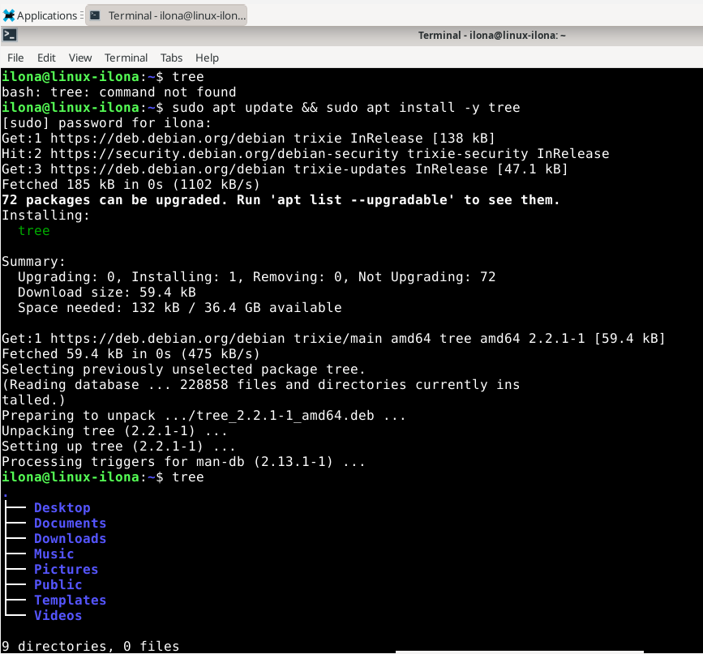

# Komentorivin perusteet

## Liikkuminen ja katselu
$ pwd - näyttää työhakemiston

$ ls - listaa työhakemiston tiedostot

$ cd terosdir/ - cd (kansion nimi) siirtyy alihakemistoon

$ cd .. - siirtyy hakemistossa yhden ylöspäin

$ less tero.txt - näyttää tekstitiedoston less-näkymässä. Välilyönti = seuraava sivu, b = edellinen sivu, / = haku, q = sulje

$ ls /etc|less - ls /etc listaa kansion /etc sisällön. Pystyviiva | avaa rivit näkymään, jossa pystyy etsimään ja selaamaan

## Tiedostojen käsittely
$ nano FOO.TXT - helpoimmat tekstieditorit pico ja nano. Tiedoston pääte voi olla mikä vaan, tekstitiedosto ei välttämättä ole .txt

$ mkdir NEWFOLDER - luo uusi kansio

$ mv OLDNAME NEWNAME - Jos NEWNAME on tiedosto, nimi muutetaan. Jos NEWNAME on kansio, OLDNAME siirretään sinne

$ cp -r ORIGINAL COPY - kopioi (kopioi myös kansion sisällön)

$ rmdir EMPTYDIR - poistaa tyhjän kansion

$ rm JUNK - poistaa tiedoston

$ rm -r FOLDEROFJUNK - poistaa kansion ja sen sisällön HUOM. rm:stä ei saa palautettua tiedostoja!

## SSH etähallinta
$ ssh tero@example.com - avaa turvallisen etäkomentorivin. Komennolla w näkee muut kirjautuneet käyttäjät. Komennolla exit takaisin omalle koneelle

$ scp -r FOLDER tero@example.com:public_html/ - kopioi kansion etäkoneen hakemistoon

## Ohjeet (Help)
$ man ls - avautuu less-näkymään

$ ls --help
$ wget -h - esim. komennoista joissa sisäänrakennettu ohje

## Historia ja muokkaus
$ ls /etc/re[tab][tab]
reportbug.conf  resolvconf/     resolv.conf - Tab kahdesti näyttää vaihtoehdot

$ history - näyttää historian

## Tärkeät hakemistot
/ – juurihakemisto. /home/tero/ – käyttäjän tero kotihakemisto. /etc/ - järjestelmän asetukset. /var/log/ - lokit

## Hallinnolliset komennot ja oikeudet
- Vähimmän oikeuden periaatteen mukaisesti tulisi käyttää normaalia käyttäjää. Korotetu oikeudet vain tarvittaessa sudo -komennolla
- Ohjelmien turvallisesti asentaminen: pakettienhallinta. $ sudo apt-get update - päivittää saatavilla olevien pakettien listan

$ sudo apt-get -y install nethack-console - asentaa ohjelman

(Lähde: Karvinen 2020:https://terokarvinen.com/2020/command-line-basics-revisited/?fromSearch=command%20line%20basics%20revisited)

# a) Micro-editorin asennus & kokeilu
1. Minulla ei ollut mitään käsitystä, mikä Micro-editor on. Katsoin aiheesta youtube-videon The BEST Text Editor on Linux? - Micro Text Editor (https://www.youtube.com/watch?v=Jw9eJu-PY08). Lisäksi tutkin ominaisuuksia ja asennusohjetta osoitteessa https://github.com/zyedidia/micro?tab=readme-ov-file#installation. Micro on vähän niin kuin Notepad, mutta toimii komentorivillä. Se on helppokäyttöinen ja siinä toimii itsellenikin tutut pikanäppäimet esim. Ctrl+S, Ctrl+Q ja Ctrl+Z / Ctrl+Y
2. Tein asennuksen seuraavilla komennoilla:

   sudo apt-get update

   sudo apt-get -y install micro
3. Seuraavaksi loin tiedoston komennolla micro testi.txt ja tallensin & suljin Ctrl+S / Ctrl+Q
4. Avasin työhakemiston komennolla ls ja tiedosto testi.txt oli tallentunut. Halusin siirtää tiedoston Documets-kansioon, joten syötin komennot mv testi.txt Documents/. Sitten varmistin että tämä onnistui komennolla ls Documents/. Ks. kuvat alta:

   

   

   

# b) APT - Komentoriviohjelman asennus
1. En ehkä täysin ymmärtänyt mitä tässä tehtävässä tuli tehdä. Selvitin tekoälyn avulla, että ohjeissa mainitulla komennolla apt-cache search version control voi etsiä pakettihakemistosta “version control” liittyviä ohjelmia. Syötin tämän komennon ja sain pitkän listan. Koska olen Linuxin käytössä vasta-alkaja, olisin ehkä osannut asentaa kolme ohjelmaa samalla kertaa komennolla sudo apt-get update && sudo apt-get install -y (ohjelmien nimet lueteltuina), mutta en olisi osannut käyttää näitä. Tämän sijaan latasin aikaisemmin oppitunnilla jonkun esitelleen cowsayn. Lisäksi huomasin oppitunnilla, että komento tree ei toimi, joten latasin myös tämän. Ks. alla kuvat

    

    

    

